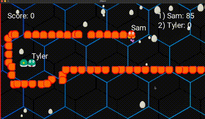

# Multiplayer Snake

This Multiplayer Snake Game is a modern, competitive take on the classic Snake experience, designed for real-time, multiplayer gameplay. Players aim to grow the longest snake while navigating an arena filled other players.

  

## Set up
1. Ensure C#/.NET, MonoGame, and this project are installed
2. Turn on the server by navigating to the 'Server' subdirectory with one terminal window. Run 'dotnet build' then 'dotnet run' to get this running.
3. To join the game, navigate to the 'Client' subdirectory in another terminal window. Enter 'dotnet build' then 'dotnet run'.

## Tech Stack
- C#/.NET, and MonoGame
- This server setup is a multithreaded message queue server
- Designed using the Entity-Component-System (ECS) design framework.